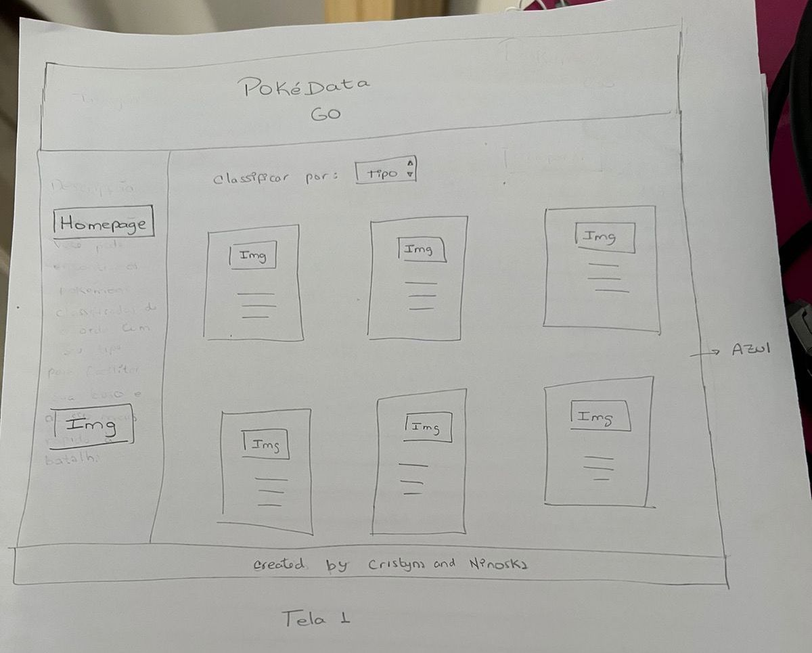
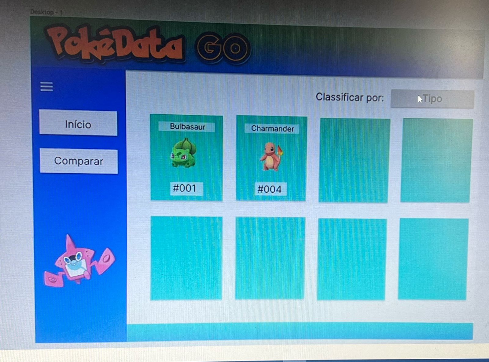
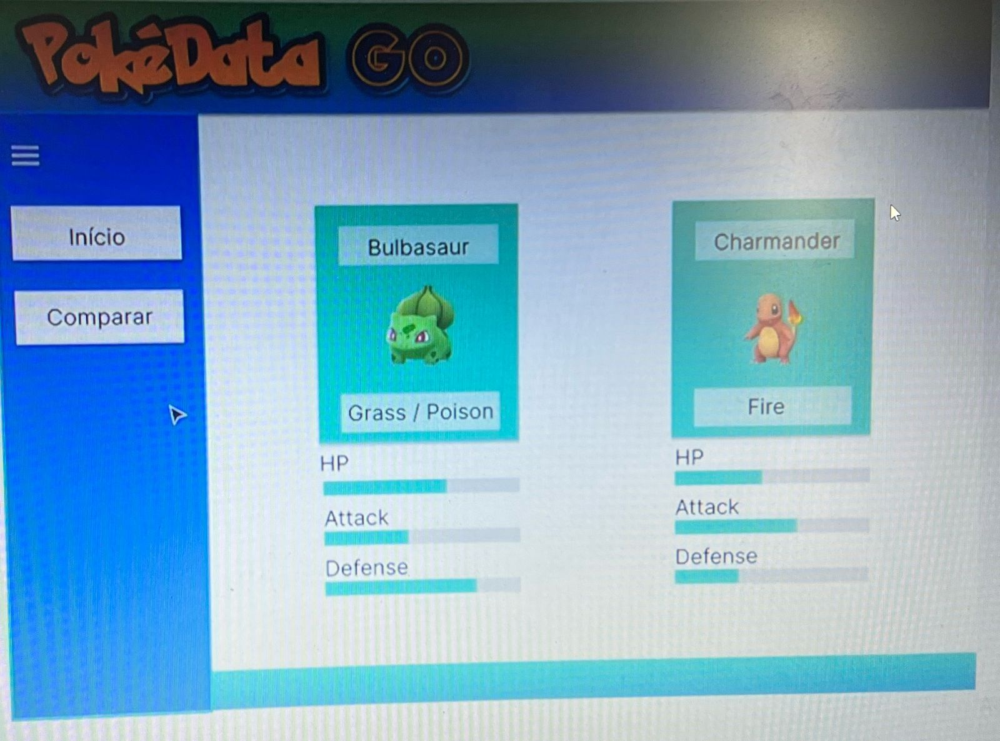
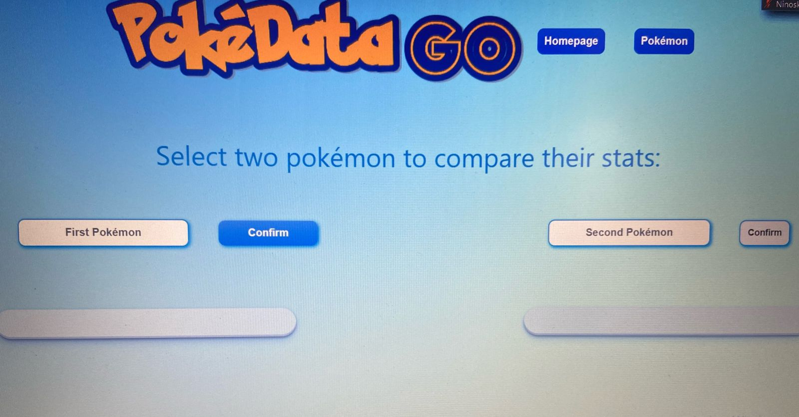
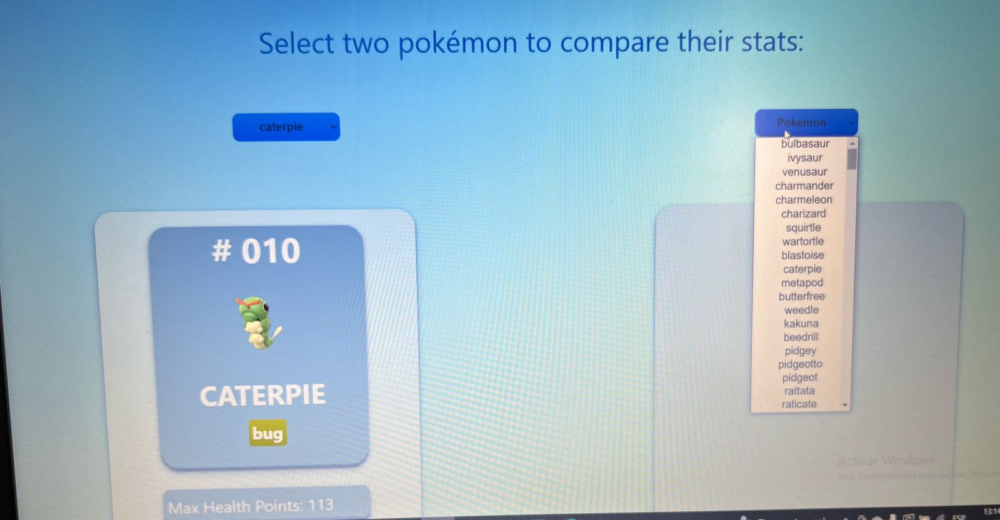

# PokéData Go 

>  Pokedata Go é um website temático sobre Pokémon, onde os usuários podem visualizar e classificar os Pokémons em cards. Este projeto foi desenvolvido como uma ferramenta para ajudar os fãs de Pokémon a explorar e aprender mais sobre os diferentes Pokémons das duas primeiras gerações.

Este projeto foi desenvolvido como parte do bootcamp da Laboratoria, uma iniciativa educacional que visa capacitar mulheres para o mercado de tecnologia. 

O principal objetivo deste projeto foi fornecer uma oportunidade de estudo e prática de habilidades técnicas, incluindo HTML, CSS e JavaScript, bem como melhorar o entendimento sobre desenvolvimento web.

## Índice

* [1. Funcionalidades ](#1-Funcionalidades)
* [2. Definição de produto](#2-Definição-de-produto)
* [3. Histórias de usuário](#3-Histórias-de-usuário)
* [4. Desenho de interface do usuário](#4-Desenho-de-interface-do-usuário)
* [5. Testes de usabilidade](#5-Testes-de-usabilidade)
* [6. Tecnologias utilizadas](#6-Tecnologias-utilizadas)
* [7. Desenvolvedoras](#7-Desenvolvedoras)

## 1. Funcionalidades

- Visualização de Pokémons em cards: Os usuários podem ver os Pokémons em cards intuitivos e atraentes, exibindo informações importantes, como nome, tipo e número da pokédex.
- Classificação de Pokémons: Os usuários têm a capacidade de classificar os Pokémons de acordo com suas preferências, como por tipo, nome e número da pokédex.
Detalhes do Pokémon: Ao clicar em um card de Pokémon, os usuários podem obter informações detalhadas sobre aquele Pokémon específico, incluindo descrição, evoluções e outras características relevantes.

## 2. Definição de produto 📝

Com o PokéData Go, criamos cartões que exibem dados do pokémon para que o usuário possa navegar rapidamente e capturar as informações necessárias sobre seu pokémon favorito.

## 3. Histórias de usuário 🙋‍♀️🙋‍♂️🙋‍♀️

> Com base em entrevistas realizadas com diferentes grupos de usuários, identificamos três perfis principais de usuários para o Pokedata Go: Jogadores de Pokémon Go, Fãs do Anime e Jogos Antigos de Pokémon e Crianças Fãs de Pokémon. Essas entrevistas nos permitiram compreender as necessidades, expectativas e desejos específicos de cada grupo ao utilizar um website temático de Pokémon.

-- *"Como jogador intermediário do Pokémon Go, quero ser capaz de comparar Pokémons com base em suas estatísticas de ataque, defesa e pontos de combate para determinar quais são os mais poderosos e estratégicos para usar em batalhas."*

-- *"Como fã do anime Pokémon desejo ter acesso a informações básicas sobre cada Pokémon, como tipo, evoluções e habilidades, para obter uma melhor compreensão do universo Pokémon."*

-- *"Como uma criança fã de pokémon, gostaría de ter uma interface amigável e intuitiva que me permita navegar facilmente pelos diferentes Pokémons, para que posso aprender mais sobre eles enquanto exploro o website."*

Ao considerar as necessidades e expectativas desses diferentes grupos de usuários, buscamos criar uma experiência do usuário abrangente e envolvente no Pokedata Go, atendendo a um público diversificado de jogadores de Pokémon e fãs da franquia.
    

## 4. Desenho de interface do usuário  📝

> Inicialmente, tínhamos concebido a ideia de posicionar os botões das nossas páginas à esquerda. Contudo, ao iniciar o desenvolvimento das páginas, notamos que preferíamos a disposição dos botões no topo dos cartões. Portanto, optamos por uma abordagem diferente da ideia original, adaptando-a para melhor atender às nossas preferências estéticas e funcionais. 

   * 4.1. Protótipo de baixa fidelidade

  * 4.2. Protótipo de alta fidelidade

## 5. Testes de usabilidade  💻

<a href="https://docs.google.com/forms/d/1WNftXER5GJLubxs8ozf1oV547c7AEbu8kJPG9Zgsv00/edit#responses">Aperte aqui</a>

  Durante os testes de usabilidade, recebemos valiosas sugestões dos nossos usuários. Uma delas foi a necessidade de aprimorar o design responsivo da página inicial, a fim de garantir uma experiência consistente em diferentes dispositivos. Além disso, os usuários destacaram que seria mais conveniente e intuitivo selecionar os diferentes Pokémons a partir de uma lista, em vez de digitá-los manualmente, na página de comparação.

  Diante desses feedbacks, implementamos diversas alterações significativas em nosso projeto. Nosso objetivo principal foi tornar o website mais útil e amigável para os nossos usuários, levando em consideração as suas preferências e necessidades. Ao abraçar essas sugestões e realizar as devidas modificações, buscamos proporcionar uma experiência otimizada e agradável para todos os usuários do Pokedata Go.

  * Antes

  

  * Depois

## 6. Tecnologias utilizadas ✅

- Figma para o desenho do prótipo de baixa fidelidade.

- GitHub Pages para hospedagem de site estático .

- GitHub para armazenar o repositório do projeto.

- CSS/HTML/JavaScript para o desenvolvimento do projeto.

## 7. Desenvolvedoras 💕

<strong>Cristyna Costa</strong> <a href="https://github.com/CristynaBC">Github</a> | <a href="https://www.linkedin.com/in/cristyna-becker-costa-a36477178/">Linkedin</a>  
<strong>Ninoska Contreras</strong> <a href="https://github.com/NiEl0503">Github</a> | <a href="https://www.linkedin.com/in/ninoska-contreras-86b075129/">Linkedin</a>
